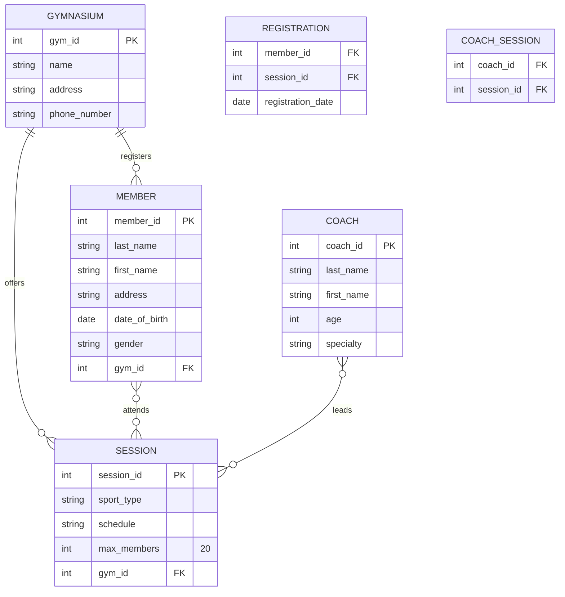

# Gym Management System ER Diagram

This directory contains the Entity-Relationship (ER) diagram for the Gym Management System checkpoint.

## ER Diagram

The following ER diagram was created using [Mermaid](https://mermaid.js.org/).

