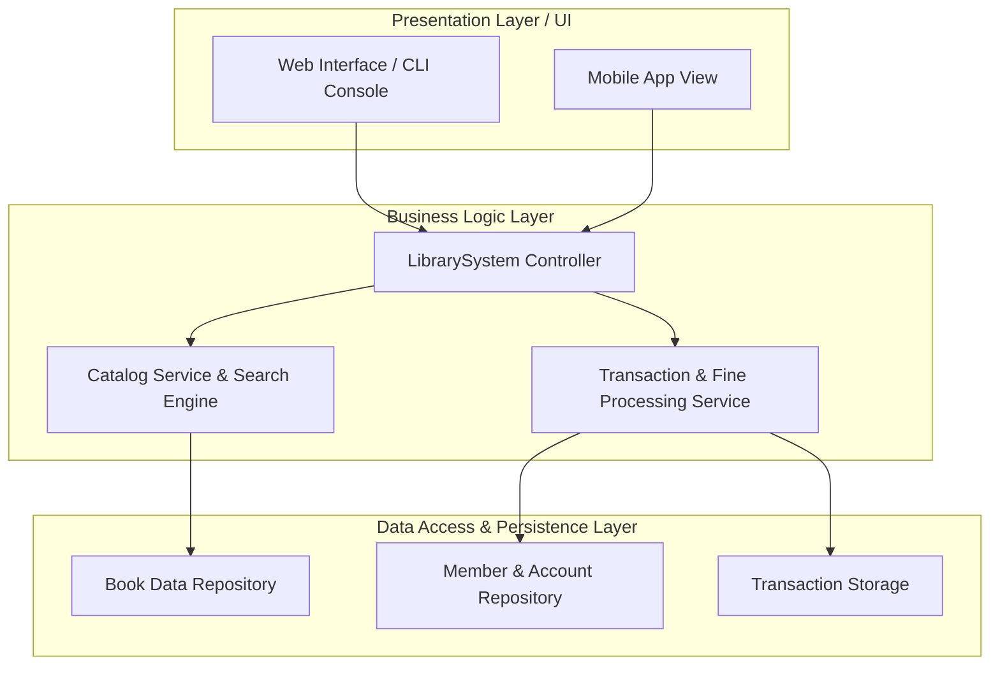
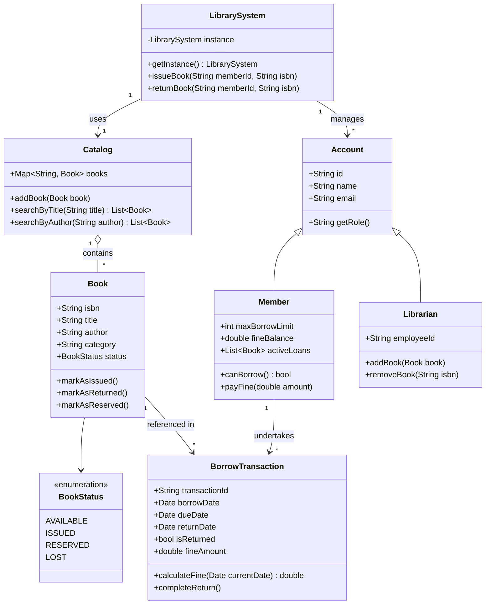
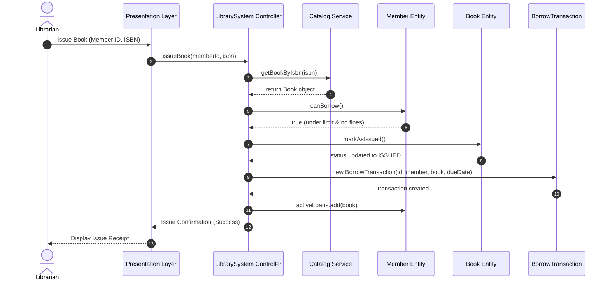
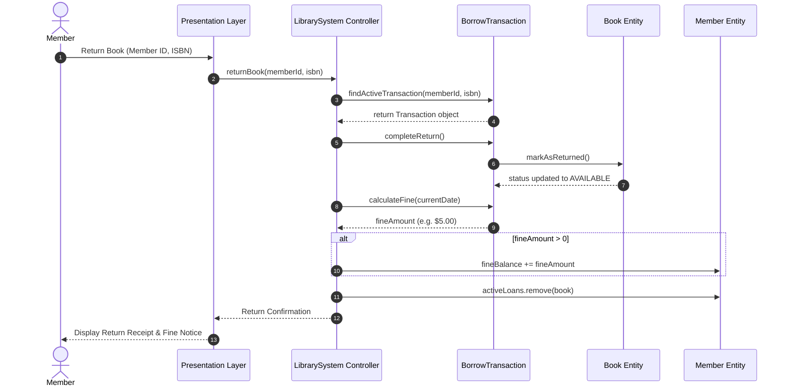
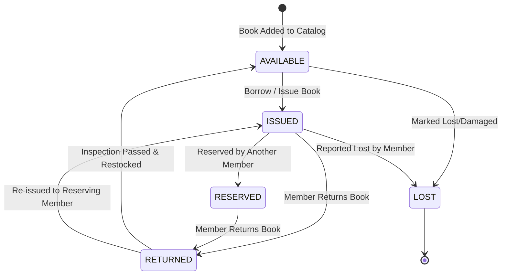

# Library Management System (LMS) - Object-Oriented Analysis & Architectural Modeling

This document provides a comprehensive Object-Oriented Analysis (OOA) specification, 3-tier system architecture design, and Unified Modeling Language (UML) behavioral models for the Library Management System (LMS).

---

## 1. Requirement Analysis

### 1.1 Main System Actors
- **Member**: Library patron (Student, Faculty, or Regular Member) who searches catalog items, borrows books, returns books, reserves unavailable items, and pays outstanding fine balances.
- **Librarian**: System administrator responsible for catalog management (adding, updating, removing books), issuing and returning books on behalf of members, managing member registrations, and calculating fine fees.

### 1.2 Key Use Cases
1. **Search Book**: Search catalog by title, author, category, or ISBN.
2. **Issue / Borrow Book**: Check member eligibility, verify book availability, and create a borrow transaction with a due date.
3. **Return Book**: Process returned book, verify if overdue, calculate fine if applicable, and update book status to `AVAILABLE`.
4. **Reserve Book**: Reserve a currently issued book so the reserving member is notified upon return.
5. **Manage Catalog**: Add new titles, update copy status, or remove damaged/lost books.
6. **Pay Fines**: Settle member outstanding fine balance.

---

## 2. System Architecture Design (3-Tier Layered Architecture)

The Library Management System is structured using a clean 3-tier architecture to separate presentation, domain business rules, and data persistence layers.



---

## 3. Object-Oriented Analysis (OOA) & UML Diagrams

### 3.1 Use Case Diagram

```mermaid
useCaseDiagram
    actor Member
    actor Librarian

    rectangle "Library Management System (LMS)" {
        usecase "Search Book" as UC1
        usecase "Issue Book" as UC2
        usecase "Return Book" as UC3
        usecase "Reserve Book" as UC4
        usecase "Pay Fine" as UC5
        usecase "Manage Catalog (Add/Remove)" as UC6
    }

    Member --> UC1
    Member --> UC3
    Member --> UC4
    Member --> UC5

    Librarian --> UC1
    Librarian --> UC2
    Librarian --> UC3
    Librarian --> UC6
```

---

### 3.2 Class Diagram



---

### 3.3 Sequence Diagram 1: Issue Book



---

### 3.4 Sequence Diagram 2: Return Book



---

### 3.5 State Diagram: Book Object Lifecycle



---

## 4. Data, Functional, and Behavioral Modeling

### 4.1 Data Model (Entity Relationship & Structure)
- **Book Domain**: Encapsulates unique `isbn`, `title`, `author`, `category`, `status` (`AVAILABLE`, `ISSUED`, `RESERVED`, `LOST`).
- **Member Domain**: Encapsulates `id`, `name`, `email`, `maxBorrowLimit` (e.g. 5 books), `fineBalance`, and active loan references.
- **Transaction Domain**: Encapsulates immutable `transactionId`, references to `Member` and `Book`, timestamps (`borrowDate`, `dueDate`, `returnDate`), and computed fine fees.

### 4.2 Functional Model (System Functions)
1. **Catalog Functionality**: Add, update, search, and list catalog items.
2. **Circulation Functionality**: Issue books, return books, calculate fines, and manage reservations.
3. **Account Management**: Register members/librarians, track borrowing quotas, and process fine payments.

### 4.3 Behavioral Model (State Transitions)
- A `Book` moves deterministically through its state machine (`AVAILABLE` -> `ISSUED` -> `RETURNED` -> `AVAILABLE`).
- A `BorrowTransaction` transitions from `Active` (unreturned) to `Completed` (returned) upon return processing.
