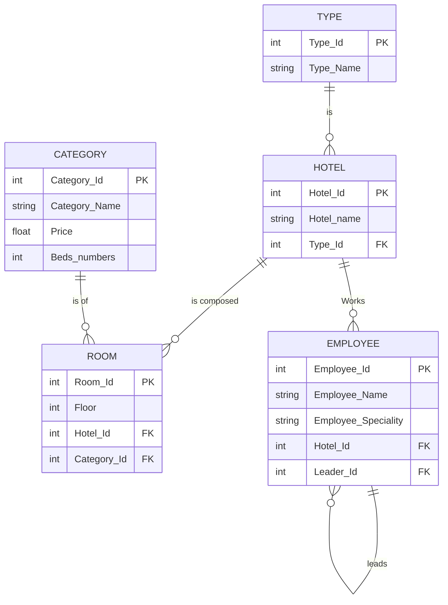

# Hotel Management System Relational Model

This directory contains the relational model for the Hotel Management System checkpoint, converted from the provided Entity-Relationship (ER) model.

## Relational Schema

Based on the ER diagram, all relationships are one-to-many (1..N). We map this by adding foreign keys to the "many" side of each relationship. Here is the resulting relational schema:

* **Type** (Type_Id, Type_Name)
  * `Type_Id` is the Primary Key.
* **Hotel** (Hotel_Id, Hotel_name, Type_Id)
  * `Hotel_Id` is the Primary Key.
  * `Type_Id` is a Foreign Key referencing `Type` (from the "is" relationship).
* **Category** (Category_Id, Category_Name, Price, Beds_numbers)
  * `Category_Id` is the Primary Key.
* **Room** (Room_Id, Floor, Hotel_Id, Category_Id)
  * `Room_Id` is the Primary Key.
  * `Hotel_Id` is a Foreign Key referencing `Hotel` (from the "is composed" relationship).
  * `Category_Id` is a Foreign Key referencing `Category` (from the "is of" relationship).
* **Employee** (Employee_Id, Employee_Name, Employee_Speciality, Hotel_Id, Leader_Id)
  * `Employee_Id` is the Primary Key.
  * `Hotel_Id` is a Foreign Key referencing `Hotel` (from the "Works" relationship).
  * `Leader_Id` is a Foreign Key referencing `Employee_Id` within the `Employee` table (from the recursive "leads" relationship).

## Relational Diagram

The following diagram visually represents the database tables, primary keys, foreign keys, and their relationships:

